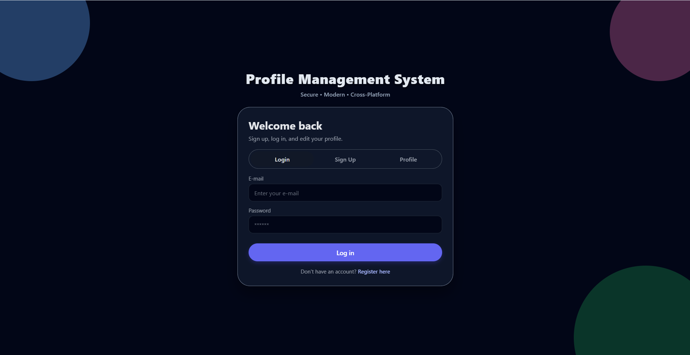
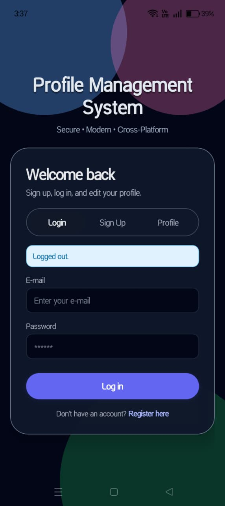

# Profile Management System — Frontend
A cross-platform Profile Management application built using **React Native (Expo)** and **TypeScript**, supporting:

- Web (Desktop + Responsive Mode)
- Android (via Expo Go App)

This frontend communicates securely with the FastAPI backend using JWT authentication.

> This project is part of a full-stack assignment. It demonstrates modern UI, client-side authentication, responsive design, and smooth user experience.

---

## 📌 Table of Contents

- [Project Goals](#project-goals)
- [Tech Stack](#tech-stack)
- [Architecture Decisions](#architecture-decisions)
- [Features](#features)
- [Setup Instructions](#setup-instructions)
- [Environment Setup](#environment-setup)
- [Running the App](#running-the-app)
- [Application Flow](#application-flow)
- [Screenshots](#screenshots)
- [Backend Link](#backend-link)
- [Demo Video](#demo-video)
- [Time Spent](#time-spent)
- [Limitations](#limitations)

---

## Project Goals

This frontend fulfills the required assignment objectives, including:

- User Signup, Login, Logout
- Editable Profile (name and bio)
- JWT Token persistence using device-local storage
- Automatic authentication restore on app launch
- Responsive UI for mobile & desktop
- Animated transitions for premium feel
- Bonus: Profile Strength Indicator

---

## Tech Stack

| Layer | Technology |
|-------|-----------|
| Framework | React Native (Expo) |
| Language | TypeScript |
| UI Styling | Custom inline theming (Tailwind-inspired) |
| State Management | React Hooks (useState, useEffect) |
| Local Storage | AsyncStorage |
| API Communication | Fetch (with response handling) |

---

## Architecture Decisions

- **JWT stored in AsyncStorage** to persist login after app close.
- **Reusable UI components** (`Button`, `Input`, `Tab`) ensure clean code organization.
- **API abstraction (`api.ts`)** enables switching between mobile and web environments automatically.
- **Animated screen switching** improves UX without heavy libraries.
- **Client-side validation/ real-time feedback**, including live profile strength scoring, reduces backend load.

---

## Features

### Completed Features
- [x] Signup (POST `/auth/signup`)
- [x] Login (POST `/auth/login`)
- [x] JWT Token storage and restore
- [x] Protected route handling (GET `/profile/me`)
- [x] Profile updating (PUT `/profile/me`)
- [x] Animated and responsive UI
- [x] Profile strength feature (bonus)
---

## Setup Instructions

### 1. Clone Repository
```bash
git clone https://github.com/sejalsharma2002/profile-management-frontend.git
cd profile-management-frontend
```

### 2. Install Dependencies
```bash
npm install
```

### 3. Backend service must be running before using the frontend.
---

## Environment Setup

Update `api.ts` to choose correct backend URL:
```bash
import { Platform } from "react-native";

let API_BASE = "http://127.0.0.1:8000"; // for web

if (Platform.OS === "android") {
API_BASE = "http://YOUR_LOCAL_IP:8000"; // your own Local_Ip check from command prompt 
}

export { API_BASE };
```

Notes:

- Replace `YOUR_LOCAL_IP` with your laptop's network IP.
```bash
ipconfig
```
- Laptop and mobile must be on the same Wi-Fi for Expo to connect.

---
## Running the App

Start Expo:
```bash
npx expo start
```
### Then choose/ press key / scan:

| Platform | Method |
|----------|--------|
| Browser | Press `w` |
| Android Device | Scan Expo QR Code |

---

## Application Flow

### Authentication

- Users sign up with name, email, and password.
- Login returns a JWT token stored in AsyncStorage.
- Returning users skip login due to session restore.

### Profile

- Displays email, name, and bio.
- Allows update with instant validation and strength scoring.

### Error Handling

- Validation warnings for missing or bad input.
- Network failure detection.
- Custom alerts for success, info, and errors.

---

## Screenshots

Desktop | Mobile
--------|--------
 | 


- [Browse Desktop Screenshots](sample/Screenshots_browser/)
- [Browse Mobile Screenshots](sample/Screenshots_mobile/)

---

## Backend Link

The backend used in this project is also open-source:

Backend Repository:
https://github.com/sejalsharma2002/profile-management-backend

---
## Demo Video

The demonstration recording is located at:  
[Click to open demo video](sample/Demo.mp4)

---

## Time Spent

| Task | Estimated Duration |
|------|--------------------|
| Expo & TypeScript Setup | 3 hr |
| UI | 5 hrs |
| backend debugging | 3 hrs |
| Debugging (Web + Mobile) | 5 hrs |
| Documentation + Cleanup | 4 hr |

Total Estimated Time: **20 hours**

---
## Limitations

This frontend implementation fulfills the majority of the expected functionality from the Full Stack Assignment. However, based on the original specification document, a few items were either simplified or not included due to time constraints and scope decisions.

### Styling Framework Requirement

- The assignment requested **NativeWind/Tailwind CSS integration**, but the current UI uses **custom inline React Native styles** inspired by Tailwind utilities
  > because of error occuring in Babel file which could not be verified in mean time.
- The app is responsive and styled well, but does not technically use the required CSS framework.

### Configuration Limitations

- Switching between **Web mode and Android mode** requires manual updating of `API_BASE` to match device IP (e.g., laptop IP for mobile testing).  
  A fully automated environment detection system was not implemented.

---

### Summary

These limitations do **not affect the core working flow**:

✔ Sign Up  
✔ Login  
✔ JWT storage and restore  
✔ Secure API communication  
✔ Profile read/update  
✔ Bonus: Profile strength indicator  

All primary requirements are functional — the above points represent enhancement opportunities for future versions.

---
